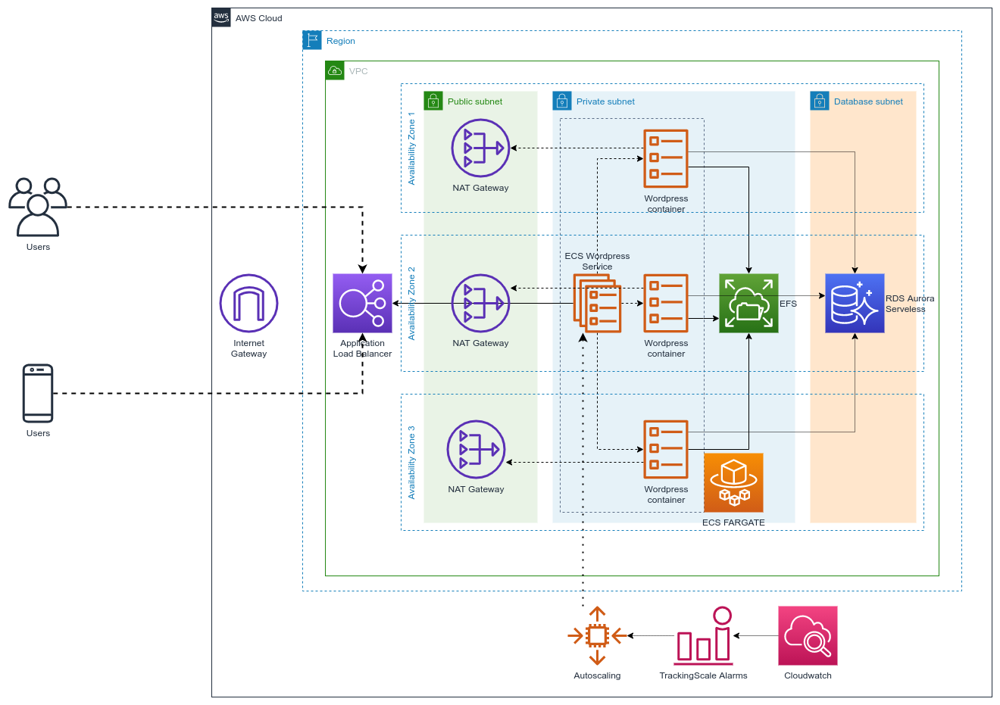

# wordpress-on-aws-infrastructure

POC deployment of a Wordpress site on AWS, using a "serverless" approach for the underlying infrastructure



---

The following architecture tries to accomplish the following requirements:

- highly reliable
- can scale horizontally
- can be deployed automatically
- entirely hosted on AWS

## Components

I've used the below AWS services to carry out this task:

- **IAM**

  *The AWS Identity and Access Management system*

- **VPC**

  *The virtual network to isolate the resources, including the following core components*:
  - Subnets
  - Route Tables
  - Internet Gateway
  - NAT Gateway


- **Application Elastic Load Balancer (ALB)**

  *The public interface to expose externallt the site*

- **Elastic Container Service (ECS)** (using Fargate launch type)

  *The engine to run the containers with Wordpress image*

- **Elastic File System (EFS)**

  *The storage layer for persistent data required by Wordpress*

- **Amazon Aurora** (Serverless capacity type)

  *The Database service required by Wordpress*

- **Cloudwatch**

  *The managed AWS Service to monitor the infrastructure components and automate some aspect (eg. Autoscaling) of them*

### Deployment method

I've chosen [***Terraform***](https://www.terraform.io/) to deploy this infrastructure using the IaC philosophy, because it's quite simple to learn and use, his language is clear and relatively easy for humans to read and write. I've also used [***Terragrunt***](https://terragrunt.gruntwork.io/) as wrapper because it add several extra tools, like automatic remote state management.

Terragrunt configure and create all the necessary resources (S3 bucket and DynamoDB tables) to use a [remote state](https://www.terraform.io/docs/language/state/remote.html) for Terraform.

I've used several battle-tested [Terraform modules](https://registry.terraform.io/browse/modules?provider=aws) to optimize the amount of code needed to provision the infrastructure.

### Architecture choices explained

- All services are almost fully managed by AWS, so the effort to setup and maintain the resources that run my application is low
- I've used a 3-tier network (Public -> Private -> Database) using all the 3 availability zones, to maximize the reliability of the infrastructure
- **Elastic Container Service (ECS)** using Fargate:
  - i've chosen to deploy a Wordpress site using containers because they are simpler to manage and upgrade than a classic installation hosted on an full OS.
  - ECS with Fargate launch type permits to run containers in a "serverless" mode, without the burden of managing the cluster of hosts
  - I've configured an Auto Scaling Policy for ECS Service using a [Target Tracking Scaling Policy](https://docs.aws.amazon.com/AmazonECS/latest/developerguide/service-autoscaling-targettracking.html) based on average CPU utilization.
- **Application Elastic Load Balancer**: it distributes the incoming traffic across multiple targets and availability zones. It can automatically scale to the vast majority of workloads.
- **Elastic File System (EFS)**: it provides a persistent storage for stateless Wordpress containers, using an highly scalable and managed NFS service which can grow and shrink automatically
- **Amazon Aurora (Serverless)**: is the serverless version of Aurora, a fully managed relational database engine that's compatible with MySQL and PostgreSQL, where scaling and failover are not developer responsibilities and are managed by AWS
- **Cloudwatch**: it monitors all AWS resources in real time, collecting and tracking metrics. It can also collect application and service logs, and use alarms for notifications and enable automatic action based on them (eg. Autoscaling)

---

## Setup

### System requirements

- [Terraform](https://www.terraform.io/downloads.html) (0.15+)
- [Terragrunt](https://terragrunt.gruntwork.io/docs/getting-started/install/) (0.29+)
- [a working AWS account](https://aws.amazon.com/premiumsupport/knowledge-center/create-and-activate-aws-account/)
- [AWS CLI (v2)](https://docs.aws.amazon.com/cli/latest/userguide/install-cliv2.html)


### Enable programmatic access to AWS account

[Create a IAM User](https://docs.aws.amazon.com/IAM/latest/UserGuide/id_users_create.html) with sufficient permissions to create, update and destroy the AWS resources defined in this infrastructure. For sake of simplicity, you can attach the AWS Managed Policy "***PowerUserAccess***" or "***AdministratorAccess***". [Create also a pair of Access keys](https://docs.aws.amazon.com/IAM/latest/UserGuide/id_credentials_access-keys.html) for programmatic access.

### Configure AWS profile

[Configure a profile for AWS CLI](https://docs.aws.amazon.com/cli/latest/userguide/cli-configure-files.html), it will be used by Terraform to authenticate with your AWS account and interact with it to provision the required resources. Export the profile in an environment variable so [Terraform can use it without further steps](https://registry.terraform.io/providers/hashicorp/aws/latest/docs#environment-variables).

For example:
```
$ aws configure --profile wp-on-aws
AWS Access Key ID [None]: ************
AWS Secret Access Key [None]: ************
Default region name [None]: eu-west-1
Default output format [None]: json
$ export AWS_PROFILE=wp-on-aws
```

### Configure environment

I've used several variables to parametrize the architecture. You can find them in [terragrunt.hcl](./terragrunt.hcl), feel free to change them.

|Name|Description|Block|Type|Default Value|
|-|-|-|-|-|
|project_name|The name of the project|locals|string|wp-on-aws|
|region|The AWS Region to create the infrastructure|locals|string|eu-west-1|
|environment|An arbitrary code to identify the environment of your architecture|locals|string|dev|
|vpc_cidr|The CIDR block of your VPC|inputs|string|10.0.0.0/16|
|public_subnets|The CIDR of public subnets|inputs|list of strings|["10.0.0.0/22","10.0.4.0/22","10.0.8.0/22"]|
|private_subnets|The CIDR of private subnets|inputs|list of strings|["10.0.32.0/21","10.0.40.0/21","10.0.48.0/21"]|
|database_subnets|The CIDR of private subnets|inputs|list of strings|["10.0.64.0/23","10.0.66.0/23","10.0.68.0/23"]|
|db_min_capacity|[Minimum ACU (Aurora Capacity Unit) for Aurora Cluster](https://docs.aws.amazon.com/AmazonRDS/latest/AuroraUserGuide/aurora-serverless.how-it-works.html#aurora-serverless.architecture)|inputs|number|1|
|db_max_capacity|[Maximum ACU (Aurora Capacity Unit) for Aurora Cluster](https://docs.aws.amazon.com/AmazonRDS/latest/AuroraUserGuide/aurora-serverless.how-it-works.html#aurora-serverless.architecture)|inputs|number|4|
|db_autopause|[Enabled automatic pause Aurora DB cluster if idle](https://docs.aws.amazon.com/AmazonRDS/latest/AuroraUserGuide/aurora-serverless.how-it-works.html#aurora-serverless.how-it-works.pause-resume)|inputs|boolean|false|
|db_autopause_after_seconds|[Amount of time (in seconds) with no activity before the Aurora DB cluster is paused](https://docs.aws.amazon.com/AmazonRDS/latest/AuroraUserGuide/aurora-serverless.how-it-works.html#aurora-serverless.how-it-works.pause-resume)|inputs|number|3600|
|task_cpu|[The CPU size of each ECS task](https://docs.aws.amazon.com/AmazonECS/latest/developerguide/task_definition_parameters.html#task_size)|inputs|number|1024|
|task_memory|[The memory size of each ECS task](https://docs.aws.amazon.com/AmazonECS/latest/developerguide/task_definition_parameters.html#task_size)|inputs|number|2048|
|task_desired_count|[The initial desired number of tasks of ECS Service](https://docs.aws.amazon.com/AmazonECS/latest/developerguide/service_definition_parameters.html#sd-desiredcount)|inputs|number|1|
|log_retention_in_days|The default retention of Cloudwatch log groups used by some service|inputs|number|30|
|container_image_url|[The specific Wordpress image](https://hub.docker.com/_/wordpress) to use in ECS tasks|inputs|string|wordpress:5.7.0-php7.3-apache|
|container_name|The name of the container in ECS task|inputs|string|wordpress|
|container_port|The container port on which expose the Wordpress service|inputs|number|80|
|ecs_service_autoscaling_min_capacity|The minimum capacity of ECS Service Autoscaling|inputs|number|1|
|ecs_service_autoscaling_max_capacity|The minimum capacity of ECS Service Autoscaling|inputs|number|30|
|ecs_service_autoscaling_cpu_average_utilization_target|The average % of CPU utilization used in Target Tracking Scaling Policy of ECS Service|inputs|number|75|
|ecs_service_autoscaling_scale_in_cooldown|Cooldown (in seconds) to scale in for ECS Service Autoscaling|inputs|number|300|
|ecs_service_autoscaling_scale_out_cooldown|Cooldown (in seconds) to scale out for ECS Service Autoscaling|inputs|number|300|

There are also input parameters not hardcoded in this file for security best practice.

|Name|Description|
|-|-|
|db_master_username|The username of admin user of Aurora database|
|db_master_password|The password of admin user of Aurora database|

Enter them manually after every run of Terraform/Terragrunt, or pass them using a local **\<arbitrary_name\>.auto.tfvars** with this contents

Example:

***db-credentials.auto.tfvars***
```
db_master_username = "admin"
db_master_password = "password"
```

### Initialize environment

Run `terragrunt init --terragrunt-non-interactive` from the root dir of this repository

During the first run

Example of output:
```
$ terragrunt init --terragrunt-non-interactive
Initializing modules...
Downloading terraform-aws-modules/alb/aws 5.16.0 for alb...
- alb in .terraform/modules/alb
Downloading terraform-aws-modules/security-group/aws 3.18.0 for alb_sg...
- alb_sg in .terraform/modules/alb_sg
Downloading terraform-aws-modules/iam/aws 3.16.0 for ecs_task_execution_policy...
- ecs_task_execution_policy in .terraform/modules/ecs_task_execution_policy/modules/iam-policy
Downloading terraform-aws-modules/iam/aws 3.16.0 for ecs_task_execution_role...
- ecs_task_execution_role in .terraform/modules/ecs_task_execution_role/modules/iam-assumable-role
Downloading terraform-aws-modules/iam/aws 3.16.0 for ecs_task_policy...
- ecs_task_policy in .terraform/modules/ecs_task_policy/modules/iam-policy
Downloading terraform-aws-modules/iam/aws 3.16.0 for ecs_task_role...
- ecs_task_role in .terraform/modules/ecs_task_role/modules/iam-assumable-role
Downloading terraform-aws-modules/security-group/aws 3.18.0 for ecs_task_sg...
- ecs_task_sg in .terraform/modules/ecs_task_sg
Downloading terraform-aws-modules/security-group/aws 3.18.0 for efs_sg...
- efs_sg in .terraform/modules/efs_sg
Downloading terraform-aws-modules/vpc/aws 2.78.0 for vpc...
- vpc in .terraform/modules/vpc
Downloading terraform-aws-modules/rds-aurora/aws 4.3.0 for wp_db...
- wp_db in .terraform/modules/wp_db

Initializing the backend...

Successfully configured the backend "s3"! Terraform will automatically
use this backend unless the backend configuration changes.

Initializing provider plugins...
- Reusing previous version of hashicorp/aws from the dependency lock file
- Reusing previous version of hashicorp/random from the dependency lock file
- Using hashicorp/aws v3.37.0 from the shared cache directory
- Using hashicorp/random v3.1.0 from the shared cache directory

Terraform has been successfully initialized!

You may now begin working with Terraform. Try running "terraform plan" to see
any changes that are required for your infrastructure. All Terraform commands
should now work.

If you ever set or change modules or backend configuration for Terraform,
rerun this command to reinitialize your working directory. If you forget, other
commands will detect it and remind you to do so if necessary.
```

### See what would be created (plan)

Run `terragrunt plan` from the root dir of this repository

Example of output:
```
$ terragrunt plan

Terraform used the selected providers to generate the following execution
plan. Resource actions are indicated with the following symbols:
  + create
 <= read (data resources)

Terraform will perform the following actions:

  # data.aws_iam_policy_document.ecs_task_policy will be read during apply
  # (config refers to values not yet known)
 <= data "aws_iam_policy_document" "ecs_task_policy"  {
      + id   = (known after apply)
      + json = (known after apply)

      + statement {
          + actions   = [
              + "elasticfilesystem:ClientMount",
              + "elasticfilesystem:ClientWrite",
            ]
          + resources = [
              + (known after apply),
            ]
          + sid       = "AmazonECSTaskExecutionRolePolicy"
        }
    }

  # aws_appautoscaling_policy.wp-service will be created
  + resource "aws_appautoscaling_policy" "wp-service" {
      + arn                = (known after apply)
      + id                 = (known after apply)
      + name               = "dev-wp-on-aws.fargate-service-autoscaling"
      + policy_type        = "TargetTrackingScaling"
      + resource_id        = (known after apply)
      + scalable_dimension = "ecs:service:DesiredCount"
      + service_namespace  = "ecs"

      + target_tracking_scaling_policy_configuration {
          + disable_scale_in   = false
          + scale_in_cooldown  = 300
          + scale_out_cooldown = 300
          + target_value       = 75

          + predefined_metric_specification {
              + predefined_metric_type = "ECSServiceAverageCPUUtilization"
            }
        }
    }

[ output trunked ]

Plan: 72 to add, 0 to change, 0 to destroy.

Changes to Outputs:
  + alb_public_dns                    = (known after apply)
  + db_endpoint                       = (known after apply)
  + wordpress_ecs_task_definition_arn = (known after apply)

─────────────────────────────────────────────────────────────────────────────

Note: You didn't use the -out option to save this plan, so Terraform can't
guarantee to take exactly these actions if you run "terraform apply" now.
Releasing state lock. This may take a few moments...
```

### Deploy the infrastructure

Run `terragrunt apply` from the root dir of this repository, and answer "yes" to confirm the operation

Example of output:
```
$ terragrunt apply

[trunked output]

Plan: 72 to add, 0 to change, 0 to destroy.

Changes to Outputs:
  + alb_public_dns                    = (known after apply)
  + db_endpoint                       = (known after apply)
  + wordpress_ecs_task_definition_arn = (known after apply)

Do you want to perform these actions?
  Terraform will perform the actions described above.
  Only 'yes' will be accepted to approve.

  Enter a value: yes

[trunked output]

Apply complete! Resources: 72 added, 0 changed, 0 destroyed.

Outputs:

alb_public_dns = "dev-wp-on-aws-public-alb-1923875277.eu-west-1.elb.amazonaws.com"
db_endpoint = "dev-wp-on-aws-wp-db.cluster-crevobn2csnu.eu-west-1.rds.amazonaws.com"
wordpress_ecs_task_definition_arn = "arn:aws:ecs:eu-west-1:253242566409:task-definition/dev-wp-on-aws-wordpress:2"
```

#### Output values
Take note of the output values after the `terragrunt apply` phase, expecially ***alb_public_dns***

## Access the Wordpress installation

Open your favourite browser and point the url *http://\<alb_public_dns\>*, for example:

``
http://dev-wp-on-aws-public-alb-1923875277.eu-west-1.elb.amazonaws.com
``

## Cleanup

1. Run `terragrunt destroy` from the root dir of this repository, and answer "yes" to confirm the operation

```
$ terragrunt destroy

[trunked output]

Plan: 0 to add, 0 to change, 72 to destroy.

Do you want to perform these actions?
  Terraform will perform the actions described above.
  Only 'yes' will be accepted to approve.

  Enter a value: yes

[trunked output]

Apply complete! Resources: 0 added, 0 changed, 72 destroyed.
```

2. Remove the S3 bucket of Terraform remote state (created automatically from Terragrunt). It is named like *\<environment\>-\<project_name\>-\<region\>-\<account_id\>-terraform-state* (es. ***dev-wp-on-aws-eu-central-1-123456789012-terraform-state***)

3. Remove the DynamoDB Table for Terraform state locks (created automatically from Terragrunt). It is named like *\<environment\>-\<project_name\>-terraform-state-locks* (es. ***dev-wp-on-aws-terraform-state-locks***)
---

## TODO

- Secure Wordpress access using HTTPS
- CD Pipeline for Wordpress
